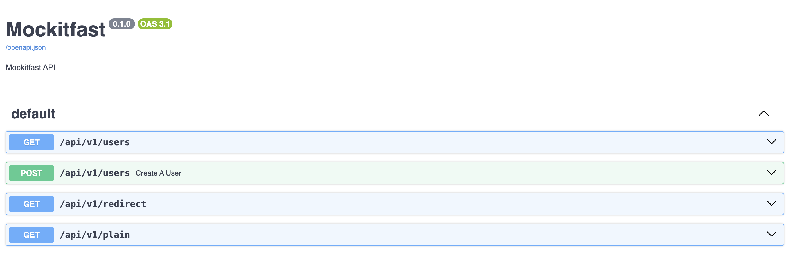

# Contributing

This file contains a guideline about how to build the app in the local machine, and execute it.

## Build

1) Run `make setup`, and edit the variables in .env file.
2) Run `make build`.

## Start

Run `make run` to start the container.

## Reference

You can check the documentation about how to use this service [here](https://docs.agustinvazquez.me/mockitfast).

## Router config
You can configure your mocked API in the [router.json](../example/router.json) file.
You can modify it on the run, while the service is running and the changes will be impacted on runtime. This is achieved using a really simple [file watcher](../src/watcher.py).

## Swagger

> **_NOTE:_**  The following URL might change depending on what is configured in your .env file.

After running the project you can access the swagger of your mocked API going to: [127.0.0.1:3000/docs](http://127.0.0.1:3000/docs).

You should see something like the following:

